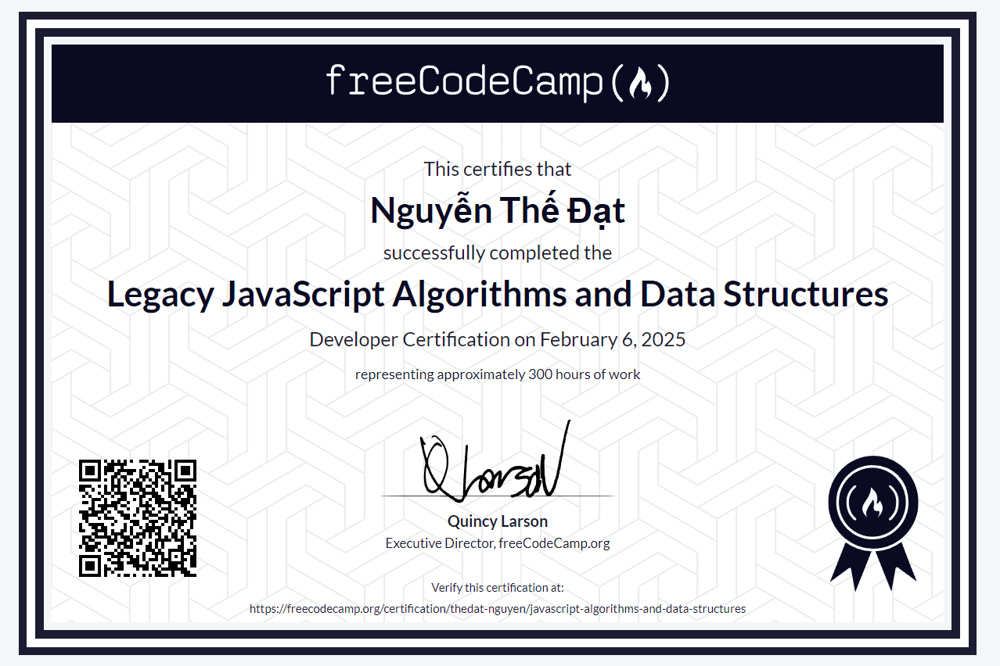

# JavaScript Algorithms and Data Structures Projects

As part of the JavaScript Algorithms and Data Structures certification, I have developed and successfully completed several projects. These projects include:

- **Palindrome Checker**: A tool that verifies if a given string is a palindrome.
- **Roman Numeral Converter**: A utility that converts a number into its Roman numeral equivalent.
- **Caesar’s Cipher**: An encryption algorithm that shifts characters in a string by a certain number.
- **Telephone Number Validator**: A function that checks if a given telephone number is valid based on a specific format.
- **Cash Register**: A program that calculates the change required for a given amount, using different denominations of currency.

I have passed all the automated tests for these projects, showcasing my understanding and ability to implement fundamental JavaScript concepts and algorithms.

## Feel free to explore

Feel free to explore and refer to these projects for learning purposes. The solutions I’ve implemented follow best practices and provide clear examples of how to tackle common programming challenges using JavaScript. 
Whether you're just starting out or looking to improve your skills, these projects can serve as valuable resources to deepen your understanding of algorithms and data structures.

---

